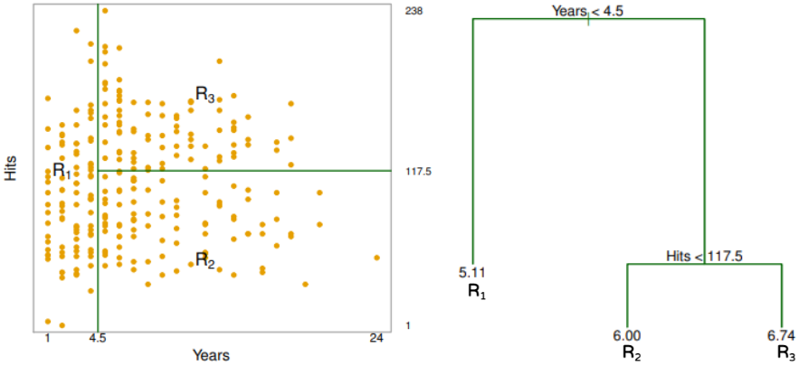
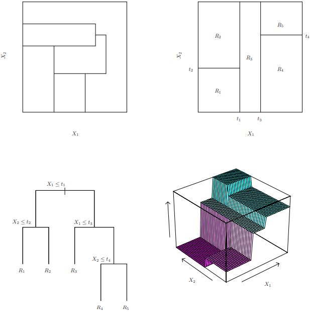

```{r setup, include=FALSE}
knitr::opts_chunk$set(echo = TRUE)
```

# Árvore de decisão

A árvore de decisão envolve *estratificar* ou *segmentar* o espaço das preditoras em várias regiões simples. Para fazer uma previsão para uma determinada observação, normalmente usamos a média ou o valor da resposta modal para as observações de treinamento na região à qual ela pertence. Como o conjunto de regras de divisão usadas para segmentar o espaço do preditor pode ser resumido em uma árvore, esses tipos de abordagens são conhecidos como métodos de árvore de decisão. Os métodos baseados em árvores são simples e úteis para interpretação. No entanto, eles normalmente não são competitivos com as melhores abordagens de aprendizado supervisionado em termos de precisão de previsão. Portanto, neste projeto também apresentamos *bagging* e *florestas aleatórias*. Cada uma dessas abordagens envolve a produção de várias árvores que são então combinadas para produzir uma única previsão. Veremos que combinar um grande número de árvores muitas vezes pode resultar em melhorias dramáticas na precisão da previsão, às custas de alguma perda na interpretação.

Discutimos agora o processo de construção de uma árvore de regressão. Grosso modo, são duas etapas.

1.  Dividimos o espaço das preditoras --- isto é, o conjunto de valores possíveis para $X_1, X_2,…,X_p$ --- em $J$ regiões distintas e não sobrepostas, $R_1, R_2,…,R_J$.

2.  Para cada observação que cai na região $R_j$, fazemos a mesma previsão, que é simplesmente a média dos valores da variável resposta para as observações de treinamento em $R_j$.

Para exemplificar, veja a figura abaixo. Temos as preditoras $X_1$ = Years e $X_2$ = Hits para uma determinada variável resposta. No gráfico à esquerda, dividimos o espaço das preditoras e 3 regiões distintas e não sobrepostas, $R_1, R_2, R_3$ (Passo 1). No gráfico à direita, temos a representação das regiões no formato de árvore, onde cada região contém a média dos valores da variável resposta (Passo 2). Por exemplo, se uma nova observação tiver Years \< 4.5, a prevemos como 5.11.



Como construímos as regiões $R_1,…,R_J$? Em teoria, as regiões poderiam ter qualquer forma. No entanto, optamos por dividir o espaço das preditoras em retângulos de alta dimensão, ou caixas, para simplificar e facilitar a interpretação do modelo preditivo resultante. O objetivo é encontrar caixas $R_1,…,R_J$ que minimizem o RSS, dado por

$$\sum_{j=1}^{J} \sum_{i \in R_{j}}\left(y_{i}-\hat{y}_{R_{j}}\right)^{2},$$

onde $\hat y_{R_j}$ é a resposta média para as observações de treinamento dentro da j-ésima caixa. Infelizmente, é computacionalmente inviável considerar todas as partições possíveis do espaço de features em $J$ caixas. Por esse motivo, adotamos uma abordagem *gananciosa de cima para baixo*, conhecida como *divisão binária recursiva*. A abordagem de divisão binária recursiva é *de cima para baixo* porque começa no topo da árvore (no ponto em que todas as observações pertencem a uma única região) e então divide sucessivamente o espaço das preditoras; cada divisão é indicada através de dois novos ramos mais abaixo na árvore. É *gananciosa* porque em cada etapa do processo de construção da árvore, a *melhor* divisão é feita naquela etapa específica, em vez de olhar para frente e escolher uma divisão que levará a uma melhor árvore em alguma etapa futura.

Para realizar a divisão binária recursiva, primeiro selecionamos o preditor $X_j$ e o ponto de corte $s$ de modo que dividir o espaço das preditoras nas regiões $\{X|X_j < s\}$ e $\{X|X_j ≥ s\}$ leva à maior redução possível em RSS. Ou seja, consideramos todos as preditoras $X_1,…,X_p$ e todos os valores possíveis do ponto de corte $s$ para cada um das preditoras e, em seguida, escolhemos a preditora e o ponto de corte de modo que a árvore resultante tenha o RSS mais baixo.

Em seguida, repetimos o processo, procurando o melhor preditor e o melhor ponto de corte para dividir ainda mais os dados de modo a minimizar o RSS dentro de cada uma das regiões resultantes. No entanto, desta vez, em vez de dividir todo o espaço do preditor, dividimos uma das duas regiões identificadas anteriormente. Agora temos três regiões. Novamente, procuramos dividir ainda mais uma dessas três regiões, de modo a minimizar o RSS. O processo continua até que um critério de parada seja alcançado; por exemplo, podemos continuar até que nenhuma região contenha mais de cinco observações.

Uma vez criadas as regiões $R_1,…,R_J$, prevemos a resposta para uma determinada observação de teste usando a média das observações de treinamento na região à qual essa observação de teste pertence.

Um exemplo de cinco regiões dessa abordagem é mostrado na Figura abaixo.



## Limitações

O processo descrito acima pode produzir boas previsões no conjunto de treinamento, mas é provável que tenha overfit, levando a um desempenho ruim no conjunto de teste. Isso ocorre porque a árvore resultante pode ser muito complexa. Uma árvore menor com menos divisões (ou seja, menos regiões $R1,…,RJ$) pode levar a menor variância e melhor interpretação ao custo de um pouco de viés. Uma alternativa possível para o processo descrito acima é aplicar uma técnica de regularização chamada *Tree Pruning*. Não vamos entrar em detalhes sobre como essa técnica funciona. Para mais detalhes consulte o livro na bibliografia.

## Simulação

efhdytef

# Boosting
